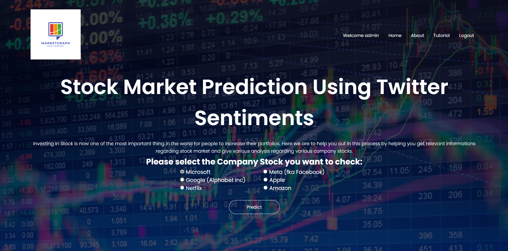
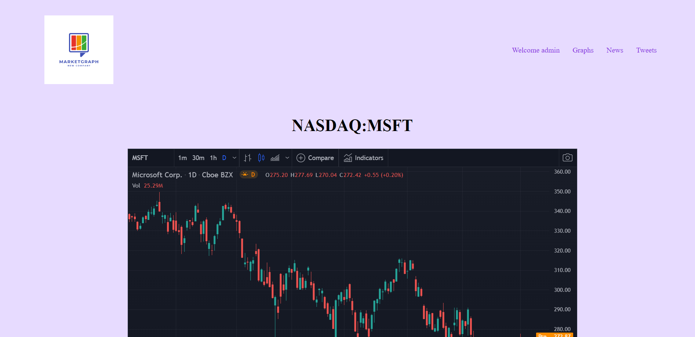
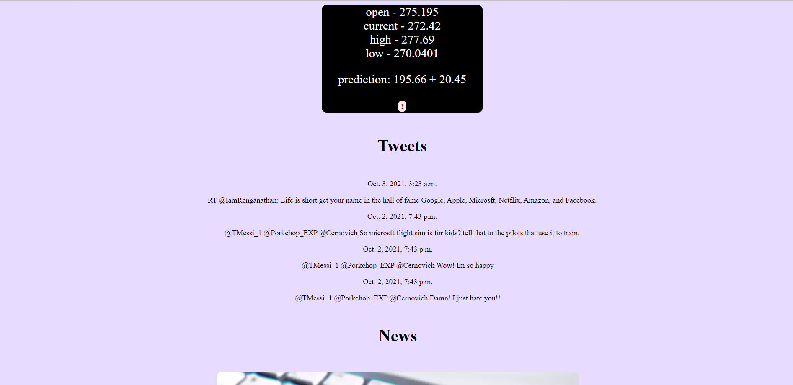
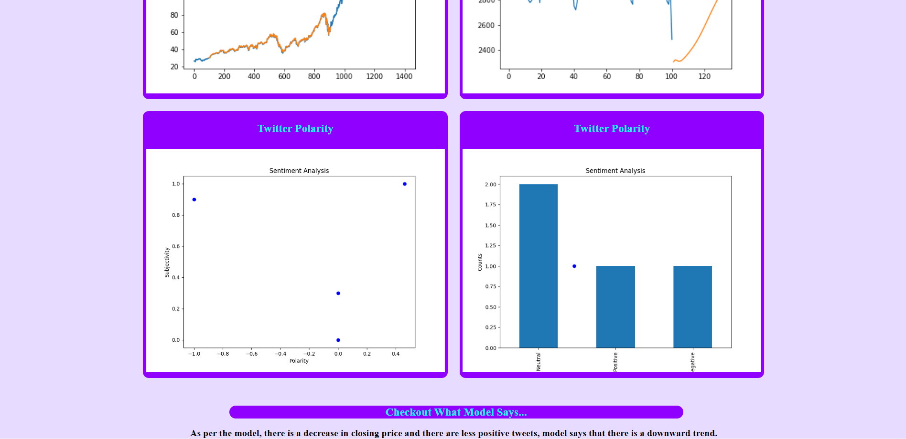

# SPUTA
Stock Prediction Using Twitter Analysis (SPUTA) is a website that enables users, such as investors, stockholders and other people who are interested in investing in stocks, to select the company name and in return have the advantage of knowing the flow of day to day stock prices of the company they’ve invested in or are interested to invest in. Our customers will select a company name which will send a stock ticker symbol to the backend and they'll be provided with a prediction whether the price will increase or decrease. Along with that they'll also access various graphical results that are easily understandable. We used a system that services users with information that a machine has produced thus there is no human discrepancy. Currently this system is only for Microsoft, Google, Meta, Netflix, Amazon and Apple and is for NASDAQ.  

## Features
* Displays Graphical Data and Prediction Price of the stock for the mentioned 6 companies and an output that will say whether there is an upward trend or downward trend.
* Uses an API to display the past prices of the mentioned 6 companies via a graph.
* Uses an API to display the current's day opening price, lowest price, highest price and the current price.
* Uses an API to display tweets and news related to the company as well.
* Uses an API to display videos that will help beginners to invest in stocks.
* Has a Login and Registration system.

## Images

## Important Notes
* Read Line 17 and Line 57 of views.py in companyDashboard
* Performance Graph and Next 30 Day Prediction Graph for each company have to be updated per month seperately and add it to the their ticker folder in companyDashboard/static/companyDashboard/images/ with the naming convention TICKERNAME'no_space'2_digit_monthnumber.png example: MSFT01.png

## Drawbacks
1. The UI / Web Design is not responsive 
2. The prediction is entirely based on past 100 days closing price, however it does not take into consideration sudden rises and falls in the company portfolio as stock market could be highly unpredictable sometimes.
3. Performance Graph and Next 30 Day Prediction Graph currently are dummy graphs so that SPUTA can run. You will have to update it and add it according to the important notes.
4. SPUTA doesnt have any graph generation or prediction generation within itself. It will have to be done seperately and then added according to the important notes.
5. It is important to read Line 57 of views.py in companyDashboard since the line after it has to be updated every 5 days.
6. The terminal will show "RuntimeError: main thread is not in main loop" while closing SPUTA (if you have checked a company's stock) and "UserWarning: Starting a Matplotlib GUI outside of the main thread will likely fail." while going to check a company's stock.